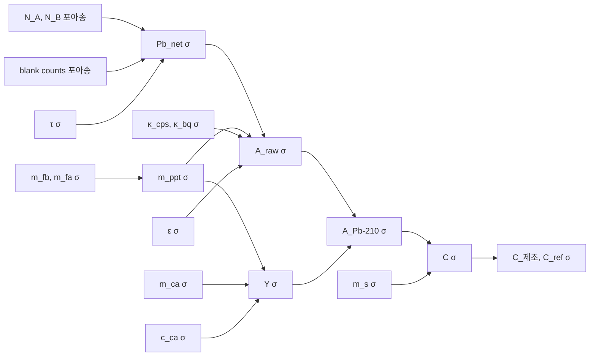

# 2-Window method를 이용한 Pb-210 방사능농도 분석

> [!info] 이 문서의 목적
> 본 프로그램(`dat-lsc-app`)이 채택한 **2-Window method**의 물리적 배경과 수학적 절차를 사용자가 이해할 수 있도록 정리한 기본 지식 문서입니다. 화학·동위원소 측정 경험은 있으나 Pb-210 분석은 처음 접하는 연구자/분석자를 대상으로 합니다.

---

## 1. 물리적 배경

### 1.1 Pb-210은 어떤 핵종인가

Pb-210은 **U-238 자연 붕괴계열**의 일원으로, 대기 중 Rn-222이 붕괴하여 생성되고 지표에 강하 침착(fallout)된다. 자연 환경시료(퇴적물, 토양, 빙하, 식품 등)에 보편적으로 존재하며, **반감기 22.2년**의 특성 덕분에 100년 이내의 **퇴적 연대 측정**, **대기 침착량 산출**, **자연방사선량 평가**에 광범위하게 활용된다.

### 1.2 붕괴 계열과 LSC 측정의 난점

```
Pb-210 ──β⁻──> Bi-210 ──β⁻──> Po-210 ──α──> Pb-206 (안정)
T½=22.2 y      T½=5.0 d        T½=138 d
Eβ,max=17 keV  Eβ,max=1162 keV  Eα=5.3 MeV
```

> [!warning] 핵심 문제
> Pb-210의 β 에너지는 **17 keV**로 매우 낮아 LSC quench와 background에 묻히기 쉽다. 반면 자손핵 Bi-210의 β는 **1162 keV**까지 분포하여 Pb-210 영역(저에너지 채널)으로 **꼬리(tailing)** 가 침범한다.

따라서 LSC 스펙트럼에서 단순히 "Pb-210 영역" 채널만 합산하면 그 안에 항상 Bi-210의 기여분이 섞여 있다. 이 기여분을 **정량적으로 제거**하는 것이 2-Window method의 핵심.

### 1.3 분석 화학 흐름

본 방법은 다음의 화학적 전처리를 전제로 한다.

1. 시료에 **납 캐리어(Pb²⁺ 용액)** 를 첨가하여 추적자/회수율 측정용 매체 생성
2. **수산화납 침전(Pb oxalate, PbC₂O₄)** 형성 → filter 포집
3. 침전물 무게로 **Lead 회수율(yield)** 산출
4. 24일 이상 ingrowth 후 Pb-210 ↔ Bi-210 [[secular equilibrium]] 도달
5. LSC scintillation cocktail에 침전물 용해/현탁 → 측정

> [!note] Secular equilibrium 가정
> Bi-210(T½=5일)은 Pb-210에 비해 훨씬 짧은 반감기를 가지므로, 24일 이상 경과하면 $\lambda_{Bi} N_{Bi} = \lambda_{Pb} N_{Pb}$ 의 평형 상태에 도달한다. 측정 시 Window A에 보이는 신호는 Pb-210의 β와, 평형 상태의 Bi-210 β tail 합이다.

---

## 2. 2-Window method 원리

### 2.1 두 채널 창의 정의

LSC 스펙트럼을 두 영역으로 분할한다.

| 창 | 범위 | 포함하는 신호 |
|---|---|---|
| **Window A** | 저에너지 (Pb-210 β 영역) | Pb-210 β + Bi-210 β tail |
| **Window B** | 고에너지 (Bi-210 β 영역) | Bi-210 β 만 (Pb-210 17 keV는 불가능) |

### 2.2 Tailing factor의 정의

순수 Bi-210 시료(또는 Bi-210만 우세한 표준)에서 **A창과 B창 사이의 일정 비율** 을 측정한다.

$$
\tau = \frac{A_{\text{net}}^{\text{Bi}}}{B_{\text{net}}^{\text{Bi}}}
$$

> [!tip] 왜 일정 비율인가
> Bi-210의 β 스펙트럼 형태는 시료/시간에 관계없이 동일하다(quench가 일정하다는 전제 하에). 따라서 한 번 결정한 $\tau$는 동일 측정 조건 하에서 모든 시료에 적용 가능하다.

### 2.3 Pb-210 순 신호 분리

실제 시료의 Window A 측정값에서 Bi-210 기여분을 빼주면 **순수 Pb-210 신호**가 남는다.

$$
\boxed{\;\text{Pb}_{\text{net}} = A_{\text{net}} - \tau \cdot B_{\text{net}}\;}
$$

이 값을 효율(efficiency)로 나누면 Pb-210 활성도(Bq)가 된다.

---

## 3. 수학적 절차 (프로그램 계산 흐름)

> [!info] 본 절은 프로그램의 "상세" 버튼 결과와 직접 대응됩니다.

### 3.1 입력값과 기호

| 변수 | 기호 | 단위 | 출처 |
|---|---|---|---|
| A창 측정 counts | $N_A$ | counts | 스펙트럼 채널 합 |
| B창 측정 counts | $N_B$ | counts | 스펙트럼 채널 합 |
| 계측 시간 | $t$ | sec | DAT 파일 |
| Filter 무게 | $m_{fb}$ | g | 사용자 입력 |
| Filter + 침전물 무게 | $m_{fa}$ | g | 사용자 입력 |
| 캐리어 첨가량 | $m_{ca}$ | g | 사용자 입력 |
| 캐리어 농도 | $c_{ca}$ | g-Pb/g | 캘리브레이션 설정 |
| 시료 질량 | $m_s$ | g | 사용자 입력 |
| 효율 | $\varepsilon$ | CPS/Bq | Std로 결정 |
| Tailing factor | $\tau$ | (무차원) | Bi-210 시료로 결정 |
| Pb-210 붕괴상수 | $\lambda$ | day⁻¹ | $\ln 2/(22.2\times365.25)$ |

### 3.2 Step ① — Net CPS (블랭크·tailing 보정)

각 창의 net CPS를 블랭크 차감으로 구한다.

$$
A_{\text{net}} = \frac{N_A}{t} - \frac{N_A^{\text{blank}}}{t^{\text{blank}}}, \quad
B_{\text{net}} = \frac{N_B}{t} - \frac{N_B^{\text{blank}}}{t^{\text{blank}}}
$$

Bi-210 tail을 차감해 순수 Pb-210 신호를 얻는다.

$$
\text{Pb}_{\text{net}} = A_{\text{net}} - \tau \cdot B_{\text{net}}
$$

**불확도** (포아송 + tailing factor):

$$
\sigma^2(\text{Pb}_{\text{net}}) = \sigma^2(A_{\text{net}}) + \tau^2 \, \sigma^2(B_{\text{net}}) + B_{\text{net}}^2 \, \sigma^2(\tau)
$$

여기서 $\sigma^2(A_{\text{net}}) = N_A/t^2 + N_A^{\text{blank}}/(t^{\text{blank}})^2$ (포아송 통계).

### 3.3 Step ② — 침전물 질량

$$
m_{\text{ppt}} = m_{fa} - m_{fb}, \quad \sigma_{m_{\text{ppt}}} = \sqrt{\sigma_{m_{fa}}^2 + \sigma_{m_{fb}}^2}
$$

### 3.4 Step ③ — 캐리어 Pb-210 보정 → activity_raw

캐리어 시약 자체에 미량의 Pb-210이 포함될 수 있다. 본 프로그램은 세 가지 보정 방식을 지원한다.

#### (a) CPS 보정 — LSC 직접 측정 (`lsc_cps`)

순수 캐리어 시약으로 침전물을 만들어 LSC로 직접 측정해 단위 질량당 CPS($\kappa_{\text{cps}}$)를 결정한 경우.

$$
\text{Pb}_{\text{net}}' = \text{Pb}_{\text{net}} - m_{\text{ppt}} \cdot \kappa_{\text{cps}}
$$

$$
A_{\text{raw}} = \frac{\text{Pb}_{\text{net}}'}{\varepsilon}
$$

#### (b) Bq 보정 — 감마/동위원소비 (`gamma_bq`, `na_bq`)

감마분광 또는 ICP-MS 동위원소비 측정으로 캐리어 내 Pb-210 비활성도($\kappa_{\text{bq}}$, Bq/g)를 결정한 경우.

$$
A_{\text{raw}} = \frac{\text{Pb}_{\text{net}}}{\varepsilon} - m_{\text{ppt}} \cdot \kappa_{\text{bq}}
$$

#### (c) 보정 없음 (`none`)

$$
A_{\text{raw}} = \frac{\text{Pb}_{\text{net}}}{\varepsilon}
$$

> [!note] `lsc_cps`와 `gamma_bq`의 차이
> - **`lsc_cps`** 는 동일한 LSC 측정 시스템에서 결정된 값을 **CPS 레벨에서** 차감하므로 효율 불확도 영향을 받지 않는다.
> - **`gamma_bq`** 는 다른 측정법(γ분광)으로 결정된 Bq 절대값을 **activity 레벨에서** 차감하므로 두 측정법의 효율이 일치한다는 가정이 필요하다.

### 3.5 Step ④ — Lead 회수율 (Yield)

화학 전처리 과정에서 회수된 Pb의 비율을 계산.

$$
Y = \frac{m_{\text{ppt}} \cdot (207.2/295.2)}{m_{ca} \cdot c_{ca}}
$$

- $207.2/295.2$: Pb 원자량 / Pb-oxalate 분자량 (침전물 질량을 Pb 환산)
- 분모: 첨가한 Pb의 총량 (g)

**불확도** (상대 불확도 제곱합):

$$
\frac{\sigma_Y}{Y} = \sqrt{\left(\frac{\sigma_{m_{\text{ppt}}}}{m_{\text{ppt}}}\right)^2 + \left(\frac{\sigma_{m_{ca}}}{m_{ca}}\right)^2 + \left(\frac{\sigma_{c_{ca}}}{c_{ca}}\right)^2}
$$

### 3.6 Step ⑤ — Yield 보정 → 실제 활성도

화학 회수율로 보정해 시료에 원래 존재하던 Pb-210 활성도를 복원.

$$
\boxed{\;A_{\text{Pb-210}} = \frac{A_{\text{raw}}}{Y}\;}
$$

$$
\frac{\sigma_A}{A_{\text{Pb-210}}} = \sqrt{\left(\frac{\sigma_{A_{\text{raw}}}}{A_{\text{raw}}}\right)^2 + \left(\frac{\sigma_Y}{Y}\right)^2}
$$

> [!important] Yield는 표시용이 아니다
> 회수율이 80%였다면 측정값은 실제의 80%만 본 것이므로, **반드시 $Y$로 나누어** 실제 활성도를 복원해야 한다. 본 프로그램의 결과 테이블 'Lead 회수율' 컬럼 값이 그대로 적용된다.

### 3.7 Step ⑥ — 비활성도(Bq/kg)

$$
C_{\text{측정일}} = \frac{A_{\text{Pb-210}}}{m_s/1000} \quad [\text{Bq/kg}]
$$

$$
\frac{\sigma_C}{C} = \sqrt{\left(\frac{\sigma_A}{A_{\text{Pb-210}}}\right)^2 + \left(\frac{\sigma_{m_s}}{m_s}\right)^2}
$$

### 3.8 Step ⑦~⑧ — 붕괴 보정

측정 시점에서 본 농도를 임의의 기준 시점으로 환산.

$$
C_{\text{기준}} = C_{\text{측정일}} \cdot \exp(\lambda \cdot \Delta t)
$$

- $\Delta t > 0$: 기준일이 측정일보다 과거 → 그 시점에는 더 많은 Pb-210이 있었음
- $\Delta t < 0$: 기준일이 측정일보다 미래 → 더 적은 Pb-210

본 프로그램은 두 가지 기준 시점에서 결과를 제공한다.

| 기준 | 의미 | 변수 |
|---|---|---|
| **제조일** (sampling_date) | 시료가 채취/제조된 시점 | $\Delta t = t_{\text{측정}} - t_{\text{제조}}$ |
| **Ref. date** | 사용자 지정 비교 기준 | $\Delta t = t_{\text{측정}} - t_{\text{ref}}$ |

---

## 4. Tailing factor 결정 — 방식 A와 방식 B

### 4.1 방식 A — Bi-210 시료 스펙트럼 사용 (자동)

Pb-210 분리 후 Bi-210만 우세한 시료(`role = Bi-210`)를 측정한 LSC 스펙트럼에서 직접 계산.

여러 Bi-210 시료가 있다면 **포아송 가중 평균**:

$$
\bar{\tau} = \frac{\sum_i w_i \tau_i}{\sum_i w_i}, \quad w_i = \frac{1}{\sigma_i^2}
$$

$$
\sigma_{\bar{\tau}} = \frac{1}{\sqrt{\sum_i w_i}}
$$

### 4.2 방식 B — counts + time 수기 입력

Bi-210 스펙트럼이 없는 경우, 사전에 결정된 Bi-210/Blank의 A·B창 counts와 측정시간을 직접 입력. 동일한 식으로 $\tau$ 계산.

---

## 5. Efficiency 결정 — Std calibration

### 5.1 방식 A — Std 시료 스펙트럼 사용 (자동)

표준 용액(Pb-210, 알려진 활성도)을 시료와 동일한 화학 전처리/측정 흐름에 통과시켜 결정.

**Step 1: 소스 활성도 (소스 제조일 기준)**

$$
A_{\text{src}} = c_{\text{src}} \cdot m_{\text{src,added}}
$$

**Step 2: 측정일로 붕괴 보정**

$$
A_{\text{src}}(t_{\text{측정}}) = A_{\text{src}} \cdot \exp(-\lambda \, \Delta t_{\text{src}})
$$

**Step 3: Std의 Lead 회수율 보정**

$$
A_{\text{src}}^{\text{eff}} = A_{\text{src}}(t_{\text{측정}}) \cdot Y_{\text{Std}}
$$

> [!note] 왜 Std에 yield를 곱하나
> Std도 동일한 침전 화학을 거치므로 동일한 회수율 손실을 겪는다. 따라서 LSC가 본 신호는 $A_{\text{src}} \cdot Y_{\text{Std}}$ 만큼이다. Efficiency는 "이 신호 ↔ Pb_net" 의 비율이므로 분모에 $Y_{\text{Std}}$ 를 곱해주어야 한다.

**Step 4: Efficiency**

$$
\varepsilon = \frac{\text{Pb}_{\text{net}}^{\text{Std}}}{A_{\text{src}}^{\text{eff}}} \quad [\text{CPS/Bq}]
$$

### 5.2 방식 B — 수기 입력

Std 시료가 없거나 사전 calibration이 있는 경우, $\varepsilon$ 와 $\sigma_\varepsilon$ 를 직접 입력.

---

## 6. 불확도 전파 요약

본 프로그램은 다음 입력 불확도를 모두 최종 농도까지 전파한다.



> [!tip] 불확도 검토 시 주목할 항목
> 일반적으로 **Pb_net의 포아송 불확도**(저활성도 시료)와 **yield의 m_ppt 불확도**(소량 침전물)가 지배적이다. 시료 질량 불확도($\sigma_{m_s}$)는 보통 무시할 수준.

---

## 7. 시료 역할(Role) 체계

본 프로그램은 LSC 데이터셋의 각 시료를 네 가지 역할 중 하나로 분류한다.

| Role | 용도 | 필수 입력 |
|---|---|---|
| **Blank** | 모든 시료의 background 차감 | (없음, 스펙트럼만) |
| **Bi-210** | 방식 A tailing factor 자동 결정 | (Pb-210 제거된 Bi-210 시료) |
| **Std** | 방식 A efficiency 자동 결정 | source_conc, source_added, source_date |
| **Sample** | 농도 분석 대상 | mass, filter wt., carrier_added, sampling_date |

> [!info] 최소 요구사항
> - 농도 분석에는 **Blank 1개 + Sample 1개 이상** 필수
> - 방식 A 자동 계산을 모두 활용하려면 **Blank + Bi-210 + Std + Sample** 모두 필요
> - 방식 B(수기 입력) 사용 시 Bi-210 또는 Std는 생략 가능

---

## 8. 계산 순서 요약 (한눈에 보기)

```
[측정 스펙트럼]
        ↓
① A_net, B_net (블랭크 차감)
        ↓
② Pb_net = A_net − τ · B_net          ← Tailing factor
        ↓
③ Carrier Pb-210 보정 → A_raw         ← lsc_cps / gamma_bq / na_bq / none
   - lsc_cps: pb_net 레벨 보정
   - gamma_bq/na_bq: A_raw 레벨 보정
        ↓
④ Lead 회수율 Y 계산
        ↓
⑤ A_Pb-210 = A_raw / Y                ← 회수율 보정
        ↓
⑥ C_측정 = A_Pb-210 / (m_s/1000)
        ↓
⑦ C_제조 = C_측정 · exp(λ · Δt_제조)
   C_ref  = C_측정 · exp(λ · Δt_ref)
```

---

## 9. 자주 묻는 질문

> [!question] Q. 왜 단순히 Window A만 합산하지 않는가?
> Window A에는 Pb-210 β와 Bi-210 β tail이 섞여 있다. Bi-210 기여분은 시료마다 다를 수 있으므로, 매 측정마다 Window B로 정량하여 차감해야 한다.

> [!question] Q. Lead 회수율이 0.6 정도면 측정이 잘못된 것인가?
> 아니다. 회수율 0.5~0.9는 정상 범위이며, 정확하게 측정·보정만 되면 최종 농도에 영향을 주지 않는다. 다만 회수율이 너무 낮으면(예: <0.3) **불확도가 크게 증가** 하므로 화학 전처리 점검이 필요할 수 있다.

> [!question] Q. Bi-210 시료 없이 분석할 수 있나?
> 가능하다. Tailing factor를 **방식 B**(counts/time 수기 입력) 또는 사전에 결정된 값으로 입력하면 된다. 마찬가지로 Std 없이 efficiency를 수기 입력해도 분석이 진행된다.

> [!question] Q. 제조일과 Ref. date의 차이?
> - **제조일**: 시료별로 다른, 그 시료가 채취/제조된 날짜. 시료의 "원래 농도"를 의미.
> - **Ref. date**: 모든 시료를 공통 기준 시점으로 정렬해 비교하기 위한 사용자 지정 날짜. 시계열 분석이나 보고서 비교에 사용.

---

## 참고 문헌

- Sanchez-Cabeza, J.A. & Ruiz-Fernández, A.C. (2012). ²¹⁰Pb sediment radiochronology: An integrated formulation and classification of dating models. _Geochim. Cosmochim. Acta_, 82, 183-200.
- Vesterbacka, P. & Ikäheimonen, T.K. (2005). Optimization of ²¹⁰Pb determination via spontaneous deposition of ²¹⁰Po on a silver disk. _Anal. Chim. Acta_, 545, 252-261.
- IAEA-TECDOC-1360. _Measurement of radionuclides in food and the environment._

---

## 관련 문서

- [[pb210-analysis-concept]] — 본 프로그램의 설계 개념과 데이터 구조
- [[#3. 수학적 절차 (프로그램 계산 흐름)]] — 계산 단계 본문
- [[#6. 불확도 전파 요약]] — 불확도 흐름 다이어그램
